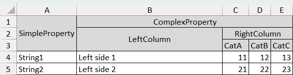

[](https://github.com/mnieto/Kevull.EPPLus.MultiHeader/actions/workflows/build.yml)

# Kevull.EPPLus.MultiHeader
Extension for the [EPPlus](https://github.com/EPPlusSoftware/EPPlus) library to create reports from complex objects

Given a list like this:
```csharp
            var complexObject = new List<RootLevel> { 
                new RootLevel {
                    SimpleProperty = "String1",
                    ComplexProperty = new SecondLevel
                    {
                        LeftColumn = "Left side 1",
                        RightColumn = new ThirdLevel
                        {
                            CatA = 11,
                            CatB = 12,
                            CatC = 13
                        }
                    }
                }, 
                new RootLevel {
                    SimpleProperty = "String2",
                    ComplexProperty = new SecondLevel
                    {
                        LeftColumn = "Left side 2",
                        RightColumn = new ThirdLevel
                        {
                            CatA = 21,
                            CatB = 22,
                            CatC = 23
                        }
                    }
                }
            };
```

this code:
```csharp
            using var xls = new ExcelPackage();
            var report = new MultiHeaderReport<RootLevel>(xls, "Object");
            report.GenerateReport(complexObject);
            xls.SaveAs("Report.xlsx");
```

will render like this:




## Columns customization
The example above will apply default format. But it's possible to customize columns or add calculated ones.
The general syntax configuration is like this
```csharp
using var xls = new ExcelPackage();
List<Person> people = GetPeople();
var report = new MultiHeaderReport<Person>(xls, "People");
report.Configure(options => options
    .AddNamedStyle("CompleteNameStye", s => {
        s.Font.Italic = true;
    })
    .AddColumn(x => x.Name, 1)
    .AddColumn(x => x.Surname, 2)
    .AddFormula("CompleteName", "CONCATENATE(B2,\", \",A2)", 3, styleName: "CompleteNameStye")
    .IgnoreColumn(x => x.BirthDay)
).GenerateReport(people);
xls.SaveAs(path);
```

### Columns
By default each leaf property in the object is rendered into a Column. There are a set of column types depending on the property data type and your necessities. The generic method is:
```csharp
AddColumn(Expression<Func<T, object?>> columnSelector, int? order = null, string? displayName = null, bool hidden = false, string? styleName = null)
```
- **columnSelector**: allows to specify at compilation time the property to be rendered
- **order**: Diplay order (1-based). Order is relative to the other columns. Columns that have no order are added after those that have it
- **displayName**: Human friendly name for the column to be shown in Excel. If not specified, the property Name is used.
- **hidden**: Column is written to Excel, but it's hidden. Don't confuse with `IgnoreColumn` method.
- **styleName**: style name of any style defined in Workbook.Styles. _See below_

#### AddEnumeration
Specialized column that renders data from a `IDictionary<TKey, TValue>` or `IEnumerable<T>`

This column will render always two header levels:
- The first with the property name
- The second with the possible values in the collection

It's important to know in advance the number of columns to be rendered. For that you need to specify the `keyValues` parameter. If, during the report generation a value other that the specified is found, an exception it's thrown.

For example, given a list of objects of type:
```csharp
class Product {
    public property Name {get; set; }
    public Dictionary<string, int> Categories {get; private set; } = new Dictionary<string, int> {
        { "CatA", 1 },
        { "CatB", 2 },
        { "CatC", 3 }        
    }
}
```
you can configure the column as follow:
```csharp
List<Product> data = GetProducts();
var report = new MultiHeaderReport<Product>(xls, "Object");
report.Configure(options =>
    options.AddEnumeration(x => x.Categories, data.First().Categories.Keys)
);
```
#### AddExpression
Allows to execute a lambda function for each row and return a custom value, for example
```csharp
report.Configure(options =>
    options.AddExpression("Initials", x => string.Concat(x.Name[0], '.', x.Surname[0], '.'))
);
```
#### AddFormula
 Each time the report renders a value for this column, it will use the specified formula. Be sure to use the correct absulte/relative references in the formula. You must specify the formula without the usual starting = symbol
 ```csharp
report.Configure(options => options
    .AddColumn(x => x.Name, 1)
    .AddColumn(x => x.Surname, 2)
    .AddFormula("CompleteName", "CONCATENATE(B2,\", \",A2)", 3)
```

#### AddHyperLinkColumn
Adds a column whose cells will contain a hyperlink. This involves two properties. For example:
 ```csharp
var report = new MultiHeaderReport<Person>(xls, "People");
report.Configure(options => options
    .AddHyperLinkColumn(x => x.Name, x => x.Profile)
    .IgnoreColumn(x => x.Profile)
).GenerateReport(people);
 ```
This will create a column titled Name with an hyperlink to the url of the person's profile. As the Profile property is already used in the Name column, it's convenient to ignore it (do not render the property itself).

#### IgnoreColumn
This column will not be rendered. Do not confuse with the hidden pameter in the AddXXXXX methods. With hidden, the column is rendered to an Excel column, but the column is hidden. In this case the property's data doesn't exist in the resulting Excel.


### Styles
#### AddNamedStyle
```csharp
AddNamedStyle(string name, Action<ExcelStyle> style)
```
It's possible to create an Excel style and then apply it to any number of columns. `AddNamedStyle` is a wrapper to 
the `Workbook.Styles.CreateNamedStyle()` EPPlus method. You can either prebuild a named style first with EPPlus and then assign the style name, or use AddNamedStyle.

When you assign a styleName to a column the name is not verified in the configuration phase, but during the report generation.

#### AddHeaderStyle
```csharp
AddNamedStyle(Action<ExcelStyle> style)
```
Similar to the previous one, but specific to apply format to the headers. If you do not provide any format to the headers, a default one will be used.

#### Default style for Date or Time columns
DateTime, DateOnly and TimeOnly properties are rendered with the corresponding default Date or Time format. You can override the default formats with `AddNamedStyle` and apply the built style to the column definition.

### Other customizations
#### Autofilter
If true, the report will activate the Excel autofilter for you

#### SetStartingAddress
Default top-left cell is A1. With `SetStartingAddress` you can specify any other starting cell


# Roadmap
- AutoFilter ✓
- Columns width: Default, specific width, Auto
- Conditional format
- Append rows to an existing report ✓
- Posibility to change the top-left starting point ✓